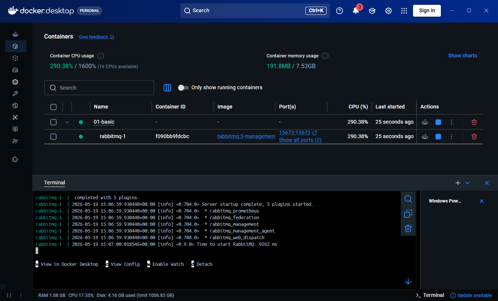
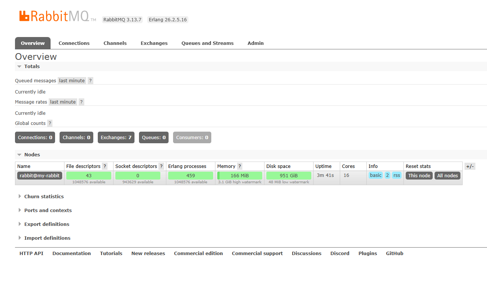
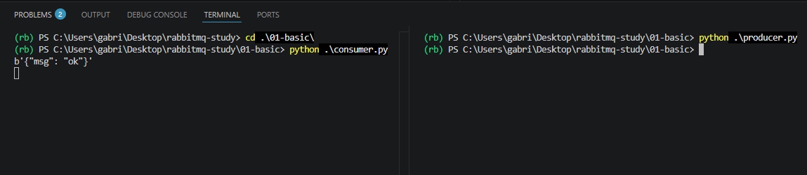
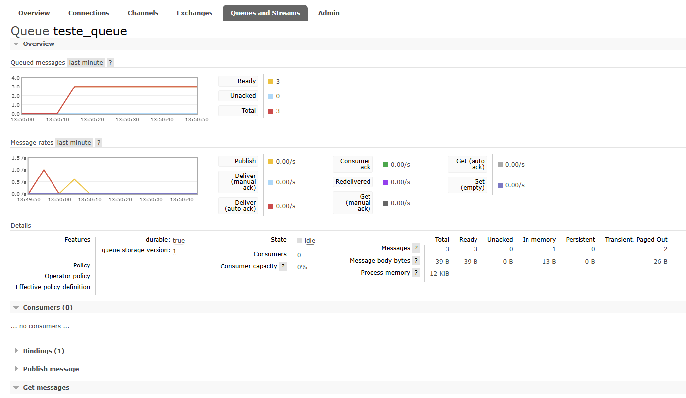
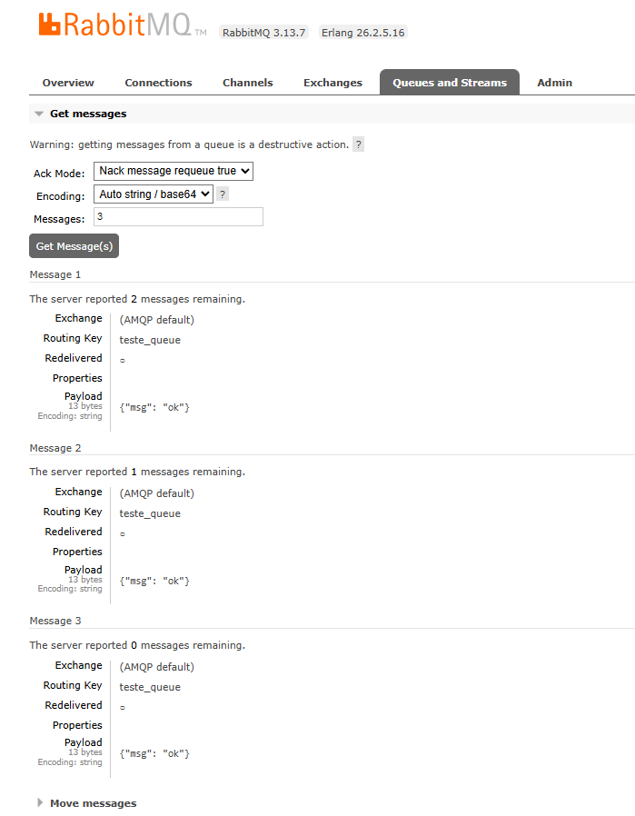

# RabbitMQ Study - Step 1: Basic Publisher & Consumer

First step of the study is to focus on communication between **Publisher** and **Consumer**, using **Docker Compose** to launch the broker RabbitMQ


## Purpose

Understand more about concepts and fundamentals of RabbitMQ

- How to publish a message
- How to consumer a message 
- How to create queues
- Basic messaging flow
- Asynchronous communication

## Architecture

```text
+-------------+      +----------------+      +-------------+
|  Publisher  | ---> |   RabbitMQ     | ---> |  Consumer   |
|   Producer  |      |     Queue      |      |  Worker     |
+-------------+      +----------------+      +-------------+
```
## Installation and Setup

First, make sure you have prerequisites:
 - Python 3.14.3
 - Docker Compose
 - Docker

1. Clone this repository:
   ```bash
   git clone https://github.com/gabrielkoyama/rabbitmq-study.git
   ```

2. Install dependences and create a virtual env: 

    Create a virtual environment named 'venv'
   ```bash
    python3 -m venv venv
   ```

    Activate the virtual environment (Linux/macOS)
   ```bash
    source venv/bin/activate
   ```

    Activate the virtual environment (Windows)
   ```bash
    venv\Scripts\activate
   ```
    
    Install project-specific dependencies
   ```bash
    pip install requirements.txt
   ```

3. Start RabbitMQ server
I'll use a tool of a Docker, called Docker Compose to start RabbitMQ server. It is not totally necessary because we'll start only one service, but it will be needed on the next steps of the project.


   ```bash
    docker compose up
   ```

   

Now, you can access RabbitMQ Management UI on URL: http://localhost:15672. Default username and password: guest.

   

   

## Execution
Now, to send a message to a queue you need to start the consumer first to create a queue and then in a different terminal or cmd you may start the producer, sending a message to the same queue created.

> I'm using the python package dotenv to read sensitive data from a .env file. Such as: host, user, password and queue.

> Note: If you start producer.py first, it will not show any error but there are not a queue to publish. That's why you have to start consumer first, or create manually the queue on RabbitMQ UI. 

Running consumer.py:
   ```bash
    cd .\01-basic
    python consumer.py
   ```
If there is no error message it means that you are connected to RabbitMQ and listening the messages on queue. Now, let's publish a message running producer.py

Running consumer.py:
   ```bash
      cd .\01-basic
      python producer.py
   ```



You can visualize the queue and messages on RabbitMQ:



Or visualize the message without sending ack (acknowledge of receving the message)



## Message Acknowledgment
By default, RabbitMQ uses acknowledgments (ACK) to confirm that a message was successfully processed by the consumer.

When a message is received:

1. RabbitMQ sends the message to the consumer
2. The consumer processes the message
3. The consumer sends an ACK back to RabbitMQ
4. RabbitMQ removes the message from the queue

## Consumer Callback Behavior
The consumer uses a callback function that is triggered every time a new message arrives in the queue.

This callback is responsible for:

- Receiving the message
- Processing the data
- Sending ACK back to RabbitMQ

> Since its just a simple example, my callback are just printing the messages. ACK is configurated on consumer to gives auto-ack, that's why we don't need to send ack back on consumer. 


## Next step
For the next step I'll implement a proper way to handle queues using Retry and Dead Letter Queue to prevent messages processing failures. 


## References
- [RabbitMQ Official Documentation](https://www.rabbitmq.com/docs)
- [Pika Documentation](https://pika.readthedocs.io/en/stable/)

