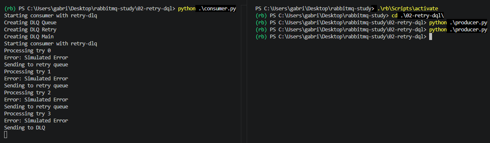
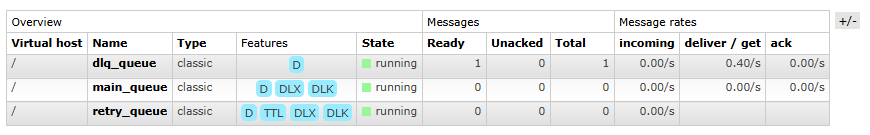
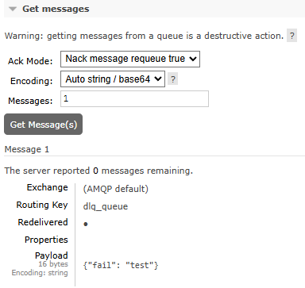

# RabbitMQ Study - Step 2: Retry and Dead Letter Queue (DLQ)

Second step of this study focuses on improving how RabbitMQ handle messages processing failures by introducing mechanisms that make the system more resilient and reliable in error scenarios.


## Architecture

```text
+-------------+        +----------------+        +------------------+        +-------------+
|  Publisher  | -----> |     RabbitMQ   | -----> |     Consumer     | -----> |   Process   |
|   Producer  |        |     Queue      |        |     Worker       |        |   Message   |
+-------------+        +----------------+        +------------------+        +-------------+
                               |                          |
                               |                          |
                               | (failure)                | (error / nack)
                               v                          v
                      +----------------+        +----------------------+
                      | Retry Queue    | -----> | Dead Letter Queue    |
                      | (delayed retry)|        | (DLQ)                |
                      +----------------+        +----------------------+
                               |
                               | (retry back to queue)
                               v
                      +----------------+
                      | Main Queue     |
                      +----------------+
```

The idea of this architecture is that when a message processing fails, the system sends it to a Retry queue, which waits for 3s before sending back to main queue. 

The system keeps track the number os retries in message header. If this number is greater than the ```MAX_RETRIES``` limit, the message is sent to Dead Letter Queue, which is a standard queue used to store messages that could not be processed sucessfully.

## Queue Design

First I set ```auto_ack=False``` on consumer to have more control over message acknowledgment. This allows the application to decide when a message is sucessfully processed (ACK) or when it fails (NACK)

The second most important part of the implementation is to create the queues.

```python
    def create_queues(self):
        channel = self._connection()
        print("Creating DLQ Queue")
        channel.queue_declare(queue=DLQ_QUEUE, durable=True)

        print("Creating DLQ Retry")
        channel.queue_declare(
            queue=RETRY_QUEUE,
            durable=True,
            arguments={
                "x-message-ttl": 5000,
                "x-dead-letter-exchange": "",
                "x-dead-letter-routing-key": RABBITMQ_QUEUE
            }
        )

        print("Creating DLQ Main")
        channel.queue_declare(
            queue=RABBITMQ_QUEUE,
            durable=True,
            arguments={
                "x-dead-letter-exchange": "",
                "x-dead-letter-routing-key": DLQ_QUEUE
            }
        )
```

There are two important arguments declaring Retry Queue: 
- x-message-ttl (TTL): defines how long the message stays in the retry queue before being reprocessed (5 seconds in this case).
- x-dead-letter-routing-key: defines where the message will be routed after TTL expiration or rejection (back to the main queue).

The main queue is configured with a Dead Letter policy that sends failed messages to the DLQ queue when they are rejected or expire without successful processing.


## Consumer Callback Behavior Update

I changed the callback to read headers and track the number of retries attempts. It also includes a simple failure simutation based on the message body content.

If the message body contains the word `fail`, the processing is considered unsuccessful.

In case of failure, the system retries processing until the `MAX_RETRIES` limit is reached. The retry count is stored in the message headers. Once the limit is exceeded, the message is sent to the Dead Letter Queue (DLQ).

```python
    def _callback(self, ch, method, properties, body):
        headers = properties.headers or {}
        retries = headers.get("x-retry", 0)

        try:
            print(f"Processing try {retries}")
            if b"fail" in body:
                raise Exception("Erro simulado")
            ch.basic_ack(method.delivery_tag)
            print("Finish")

        except Exception as e:
            print(f"Error: {e}")
            if retries < MAX_RETRIES:
                headers["x-retry"] = retries + 1
                ch.basic_publish(
                    exchange="",
                    routing_key=RETRY_QUEUE,
                    body=body,
                    properties=pika.BasicProperties(headers=headers)
                )
                print("Sending to retry queue")
            else:
                ch.basic_publish(
                    exchange="",
                    routing_key=DLQ_QUEUE,
                    body=body
                )
                print("Sending to DLQ")
            ch.basic_ack(method.delivery_tag)
```

## Test and Execution
To test the failure mechanism of the queues, let's send a message with 'fail' in content `{"fail": "test"}`.

Don't forget to launch container as mentioned before on step-1 (`docker compose up`) and activate the environment. After that, we're going to start both consumer and producer.

Running consumer.py:
   ```bash
    cd .\02-retry-dlq
    python consumer.py
   ```

Running producer.py:
   ```bash
      cd .\02-retry-dlq
      python producer.py
   ```



You can visualize on RabbitMQ UI that there is one message on DLQ Queue.





## Next step
For the next step I'll implement observability to the system with Elasticsearch and Kibana for monitoring and visualization, while also improving logging structure.


## References
- [RabbitMQ Official Documentation](https://www.rabbitmq.com/docs)
- [Pika Documentation](https://pika.readthedocs.io/en/stable/)

