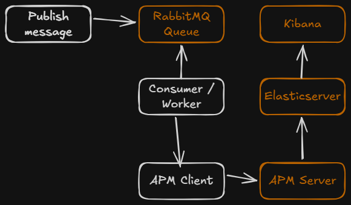
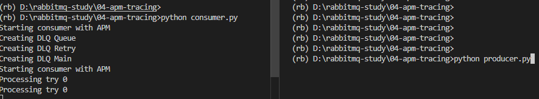
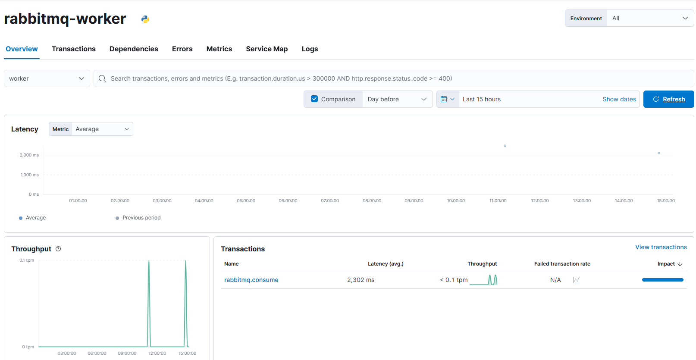

# RabbitMQ Study - Step 4: APM Tracing

Step fourth of this study focuses on collect and monitoring performance metrics from the RabbitMQ application to improve observability and system reliability.

This step introduces Application Performance Metrics (APM) to track important operation metrics, such as:

- Throughput
- Processing latency
- CPU usage
- Memory usage
- Error rate
- Message processing performance

## Architecture



Basically the worker (`consumer.py`) contains a APM Client that connects to the APM Server and collects important performance and executing data. 

The APM Server then forwards this information to Elasticsearch, where it can be visualized throught **Observability -> APM** in Kibana.  

This enables monitoring of application performance, latency, failures, and resources usage near real time.

<!-- 
talk about:
versions and issues that I had
consumer behaviour update
basic explain about how APM works
difference between Elastic agent and APM server

what each metric stands for. basic explanation
docker compose update
 -->

## Consumer Callback Behavior Update

To estabilish connection with APM Server, the application initialize an APM client resposible for sending telemetry data.

```python
from elasticapm import Client

self.apm_client = Client({
    "SERVICE_NAME": "rabbitmq-worker",
    "SERVER_URL": "http://localhost:8200",
    "ENVIRONMENT": "local"
})
```

APM client is measured by transactions, the client collects data from it. For example, latency, throughput, failure transactions, and others.

```python
    client.begin_transaction()
    client.end_transaction()
```

Spans, are used to collects information inside a transaction. For example: message processing or a specific function.

```python
with capture_span("process_message", span_type="worker"):
    time.sleep(2)
    if b"fail" in body:
        raise Exception("Simulated Error") 
```

Exceptions are used to capture processing failures. Collecting message error, traceback and associated transactions.

```python
client.capture_exception()
```

It's also possible to custom our own context matadata. For example.

```python
elasticapm.set_custom_context({
    "task_id": task_id,
    "retry": retries,
    "queue": "main_queue"
})
```
Note that this isn't implemented on the application yet.


## Test and Execution

To test APM, publish a message executing `pthon 04-apm-tracing/publisher.py`, don't forget to initialize `python 04-apm-tracing/consumer.py` with all the applied changes.



To visualize the performance metrics, access **Kibana -> Observability -> APM**.




## Next step
For next step I'll implement more observability to the system, with Prometheus and Grafana. 

## References
- [RabbitMQ Official Documentation](https://www.rabbitmq.com/docs)
- [Pika Documentation](https://pika.readthedocs.io/en/stable/)